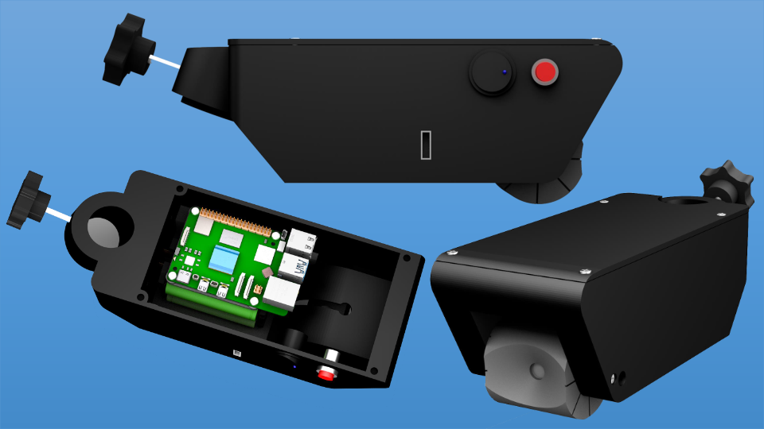
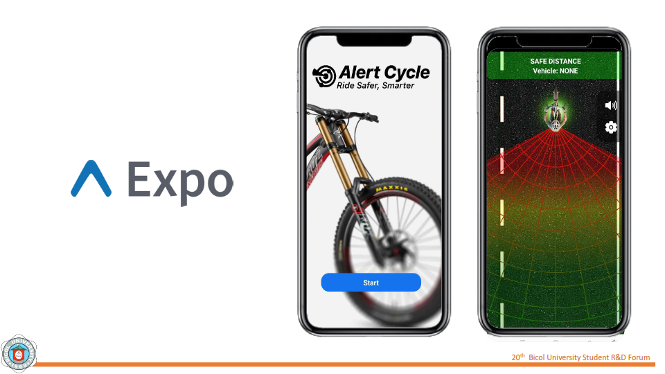
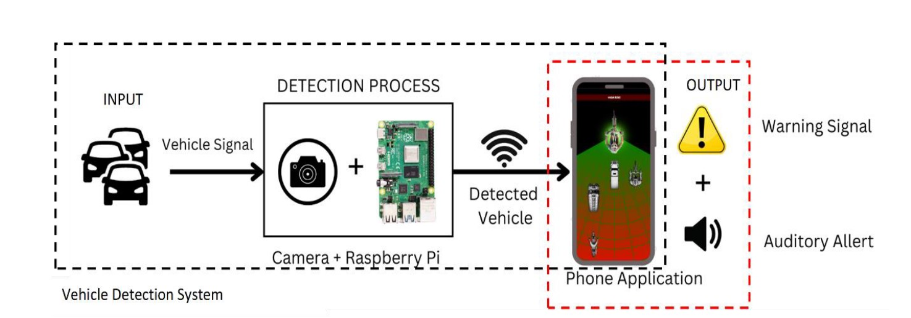
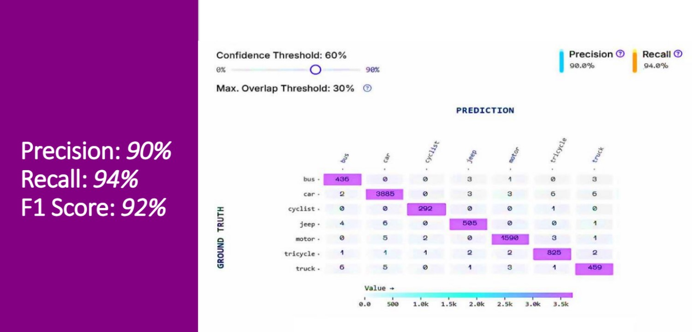

# 🚴‍♂️ Vehicle Proximity with Alert Detection 🔊📱

**Enhancing cyclist safety with AI-powered real-time vehicle detection and alerts.**

> Developed by Allen Kitts D. Alibudbud, Kenneth Gonzales, Maricon T. Saunar, and Jonel O. Olayes  
> 🏫 Bicol University Polangui  
> 📅 2025

---

## 🔍 Overview

This system is a **low-cost AI-powered alert system** designed for cyclists to detect rear-approaching vehicles and provide real-time audio-visual warnings. Combining **YOLOv5** object detection and **MonoDepth2** depth estimation, the device boosts situational awareness and helps reduce road accidents.

---

## 🧠 Tech Stack

| Component            | Description                                                  |
|---------------------|--------------------------------------------------------------|
| 📸 YOLOv5           | Real-time object detection of approaching vehicles            |
| 📏 MonoDepth2       | Depth estimation using a single camera (monocular vision)     |
| 🍓 Raspberry Pi 4B  | Central processing unit for onboard AI inference              |
| 📱 React Native     | Mobile interface showing live radar alerts & video feed       |
| 🔋 18650 Batteries  | Power source for portable deployment                          |

---

## 🛠️ Hardware Setup

- Raspberry Pi 4B (4GB RAM)
- USB Camera (HBVCAM-3M2111 V22)
- 3D-printed waterproof casing
- Power bank module + 18650 Li-ion batteries
- SSD for storage
- Passive buzzer for alerts
- Wi-Fi hotspot for mobile pairing

> 

---

## 📲 Mobile App Interface

A custom Android app displays:
- Radar-style visual warnings 🚨
- Real-time camera feed 📷
- Distance estimations 📏

> 

---

## 🎯 Features

✅ Real-time rear vehicle detection  
✅ Distance-based audio & visual alerts  
✅ High detection accuracy:  
    ðŸ“Œ Precision: 90%  
    ðŸ“Œ Recall: 94%  
    ðŸ“Œ F1-score: 92%  
✅ Rated 4.78/5 ⭐ by 25 cyclists under ISO/IEC 25010  
✅ Offline operation via onboard AI  
✅ User-friendly app interface

---

## 🚦 How It Works

1. USB camera captures rear road view.
2. YOLOv5 detects vehicles in real time.
3. MonoDepth2 estimates distance using a single frame.
4. If distance ≤ 3m, alerts are triggered.
5. App displays warnings and audio feedback.

> 

---

## 📈 Performance Summary

| Metric     | Value     |
|------------|-----------|
| Accuracy   | 95.4%     |
| Precision  | 90.0%     |
| Recall     | 94.0%     |
| F1-Score   | 92.0%     |
| Usability  | 4.76 / 5  |
| Suitability | 4.79 / 5 |

> 

---

## 📍 Field Testing

Tested in:
- Legazpi City 🚦
- Ligao 🛣️  
Under real-world urban and semi-rural traffic scenarios. Designed for cyclists like:
- 🧍‍♂️ Local commuters

> 

---

## 🔧 Limitations

- ⚠️ Not optimized for night/dark conditions
- ⚠️ Rear-only detection (no lateral/frontal awareness)
- ⚠️ Mild delays under heavy traffic
- ⚠️ Thermal throttling in extended sessions

---

## 🔮 Future Enhancements

🔗 Add V2X (Vehicle-to-Everything) comms  
🎯 360° detection with multi-camera or LiDAR  
💡 Infrared support for night vision  
🚀 Raspberry Pi 5 upgrade for better performance  
📡 Sensor fusion (e.g., radar + camera)

---

## 🙌 Acknowledgements

Huge thanks to:
- 👨‍🏫 Engr. Ben L. Saminiano (Adviser)  
- 👥 Cyclist respondents & road safety expert  
- 🧪 Electronics and Computer Engineering Dept.  
- 👨‍👩‍👧‍👦 Our families & the DOST  
- 🙏 And our Heavenly Father

---

## 📚 References

1. Gadsby & Watkins (2020)  
2. Laurel (2022) – MMDA report  
3. Niantic Labs – MonoDepth2 GitHub  
4. YOLOv5 Documentation  
5. ISO/IEC 25010 Quality Standards  
... _(More in full thesis)_

---

## 👨‍💻 Authors

- **Kenneth Gonzales** – Full-stack Developer 💻  
- **Allen Kitts D. Alibudbud** – Hardware & Integration ⚙️  
- **Maricon T. Saunar** – Research Lead & Writer 📖  
- **Jonel O. Olayes** – Designer & UX Feedback 🧠

---

🎥 **[📥 Click here to download full presentation video](./assets-for-readme/video_presentation.mp4)**
> _Includes full system demo, explanation, and highlights of real-world testing!_

---
